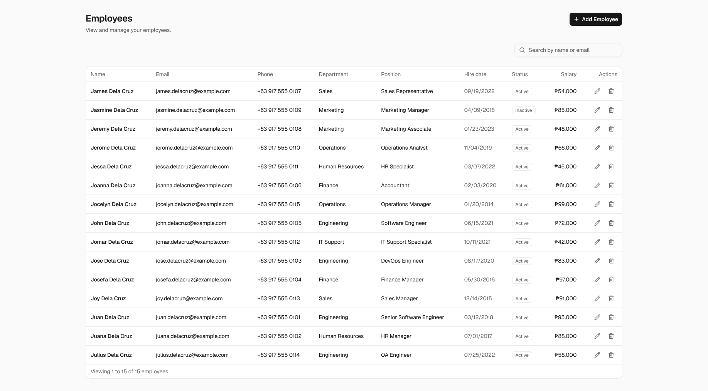
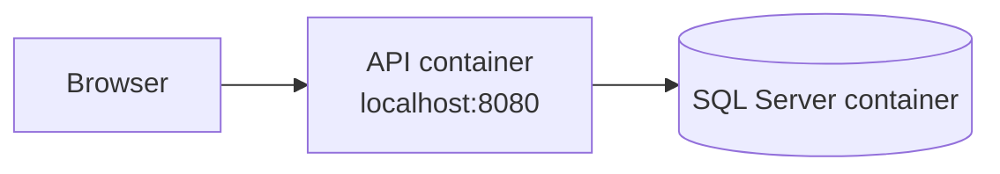

# C# MS SQL Employee Management System



## Technologies

| Use Case         | Technology                   |
| ---------------- | ---------------------------- |
| Back-End         | ASP.NET Core 10, .NET 10, C# |
| Front-End        | React · TypeScript           |
| Database         | Microsoft SQL Server 2022    |
| Data Access      | EF Core 10                   |
| UI               | ShadCN, Tailwind CSS 4       |
| Build Tool       | Vite 8                       |
| Validation       | FluentValidation             |
| Unit Tests       | xUnit                        |
| E2E Tests        | Playwright                   |
| Containerization | Docker Compose, Docker       |
| Package Managers | NuGet, pnpm                  |

## System Topology

### Containerized



## Getting Started

### Prerequisites

- Docker with Docker Compose

### Containerized

1. Create the environment file and set a strong password.

   ```bash
   cp .env.example .env
   ```

2. Build and start the API and SQL Server.

   ```bash
   docker compose up --build
   ```

3. Open the application at <http://localhost:8080>. The API is served under `/api/v1` and the readiness probe at `/health/ready`.

Stop the stack with:

```bash
docker compose down
```

### Tests

Run the back-end unit tests:

```bash
cd application
dotnet test
```

Run the end-to-end tests from the repository root, with the stack running on <http://127.0.0.1:8080>:

```bash
pnpm install
pnpm e2e
```
