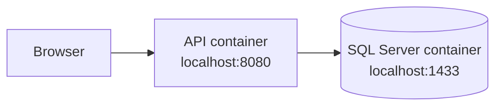

# C# MS SQL Employee Management System

## Technologies

| Use Case         | Technology                   |
| ---------------- | ---------------------------- |
| Back-End         | ASP.NET Core 10, .NET 10, C# |
| Front-End        | React · TypeScript           |
| Database         | Microsoft SQL Server 2022    |
| Data Access      | EF Core 10                   |
| UI               | ShadCN, Tailwind CSS 4       |
| Build Tool       | Vite 8                       |
| Validation       | FluentValidation             |
| Unit Tests       | xUnit                        |
| E2E Tests        | Playwright                   |
| Containerization | Docker Compose, Docker       |
| Package Managers | NuGet, pnpm                  |

## System Topology

### Containerized



## Getting Started

### Prerequisites

- Docker with Docker Compose
- .NET 10 SDK and Node.js 22+ with pnpm, only for running the tests

### Containerized

1. Create the environment file and set a strong password.

   ```bash
   cp .env.example .env
   ```

2. Build and start the API and SQL Server.

   ```bash
   docker compose up --build
   ```

3. Open the application at <http://localhost:8080>. The API is served under `/api/v1` and the readiness probe at `/health/ready`.

Stop the stack with:

```bash
docker compose down
```

### Tests

Run the back-end unit tests:

```bash
cd application
dotnet test
```

Run the end-to-end tests from the repository root, with the stack running on <http://127.0.0.1:8080>:

```bash
pnpm install
pnpm e2e
```

Helper scripts for exercising the API directly live in `application/scripts/`, for example:

```bash
./application/scripts/smoke.sh
```

## Directory Tree

```text
.
├── application/                        # ASP.NET Core Web API
│   ├── src/
│   │   ├── Common/                     # semantic exceptions + global handler
│   │   ├── Data/                       # EF Core context, entities, repositories
│   │   │   ├── Configurations/
│   │   │   ├── Entities/
│   │   │   ├── Repositories/
│   │   │   └── Scripts/                # SQL scripts (schema source of truth)
│   │   ├── Employees/                  # employee feature slice
│   │   │   ├── Controllers/
│   │   │   ├── Dtos/
│   │   │   ├── Services/
│   │   │   └── Validators/
│   │   ├── Properties/
│   │   ├── wwwroot/                    # SPA build output
│   │   ├── EmployeeManagementSystem.Api.csproj
│   │   ├── Program.cs
│   │   └── appsettings*.json
│   ├── tests/
│   │   └── EmployeeManagementSystem.UnitTests/
│   ├── scripts/                        # curl request helpers
│   ├── Dockerfile
│   └── EmployeeManagementSystem.sln
├── client/                             # React SPA
│   ├── public/
│   ├── src/
│   │   ├── app/                        # router, providers, route components
│   │   ├── components/
│   │   │   ├── layouts/
│   │   │   └── ui/                     # shadcn primitives
│   │   ├── config/
│   │   ├── features/
│   │   │   └── employees/              # employee feature slice
│   │   │       ├── api/
│   │   │       ├── components/
│   │   │       ├── hooks/
│   │   │       └── types/
│   │   ├── hooks/
│   │   └── lib/
│   ├── components.json
│   ├── index.html
│   ├── package.json
│   ├── tsconfig*.json
│   └── vite.config.ts
├── e2e/                                # Playwright tests
├── docker-compose.yml
├── package.json
├── playwright.config.ts
├── pnpm-lock.yaml
├── pnpm-workspace.yaml
├── .dockerignore
├── .env.example
├── .gitignore
└── README.md
```
